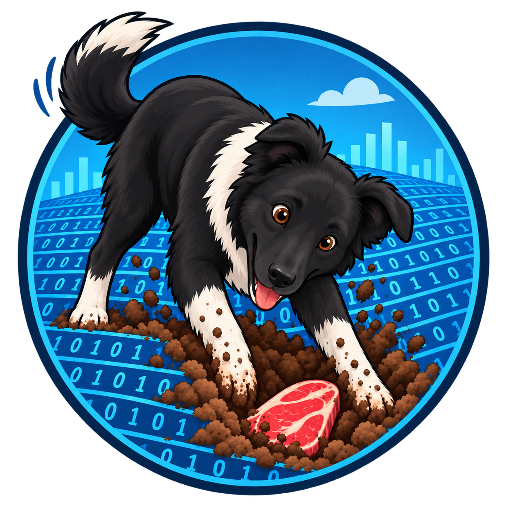

<p align="center">
  
</p>

# AthenaMining — Visual AutoML Platform

> End-to-end ML pipeline as a service. Upload data → configure → train → predict. 100% Open Source.

## Architecture

```
React (SPA) → FastAPI → Valkey (broker) → Celery Workers
                ↓                                ↓
             MinIO                    Polars + DuckDB + LightGBM
             PostgreSQL               Optuna + MLflow + Evidently AI
```

## Services

| Service | URL | Credentials |
|---------|-----|-------------|
| FastAPI Docs | http://localhost:8000/docs | — |
| MLflow UI | http://localhost:5000 | — |
| MinIO Console | http://localhost:9001 | minioadmin / minioadmin |
| Flower (Celery) | http://localhost:5555 | — |

## Quickstart

```bash
# 1. Clone & setup env
cp .env.example .env

# 2. Start all infrastructure
docker compose up -d

# 3. Install Python deps (local dev)
pip install uv
uv pip install -e ".[dev]"

# 4. Run database migrations
alembic upgrade head

# 5. Start API locally
uvicorn app.main:app --reload
```

## Running Tests (BDD with pytest-bdd)

```bash
pytest tests/ -v
```

## Pipeline Phases

| Phase | Module | Status |
|-------|--------|--------|
| 1. Data Ingestion | `app/services/ingestion/` | ✅ Scaffolded |
| 2. data_prep | `app/services/pipeline/data_prep.py` | 🚧 Next |
| 3. feature_engineering | `app/services/pipeline/feature_engineering.py` | 🚧 Planned |
| 4. training_session | `app/services/pipeline/training_session.py` | 🚧 Planned |
| 5. predict + Drift | `app/services/pipeline/predict.py` | 🚧 Planned |

## Project Structure

```
app/
├── api/v1/endpoints/   # FastAPI routes
├── core/               # Config, Celery, security
├── db/                 # SQLAlchemy models, session, repositories
├── schemas/            # Pydantic I/O models
├── services/
│   ├── ingestion/      # Connectors (CSV, Excel, Sheets, BigQuery) + MinIO storage
│   ├── pipeline/       # data_prep, feature_engineering, training, predict
│   └── registry/       # MLflow integration
└── tasks/              # Celery task definitions
tests/
├── features/           # Gherkin .feature specs
│   └── steps/          # pytest-bdd step definitions
├── unit/
└── integration/
docker/                 # Dockerfiles
```
